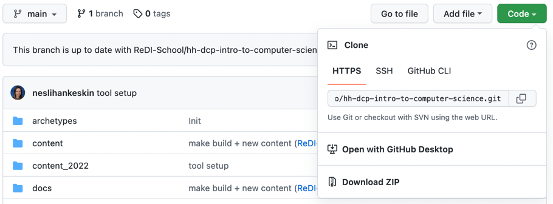
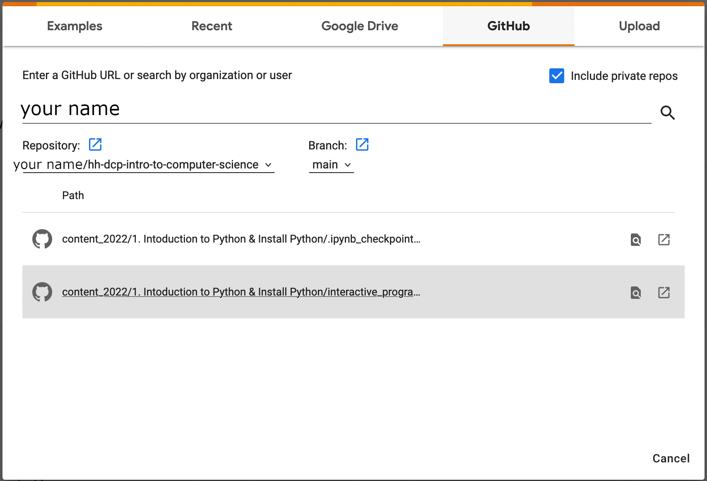
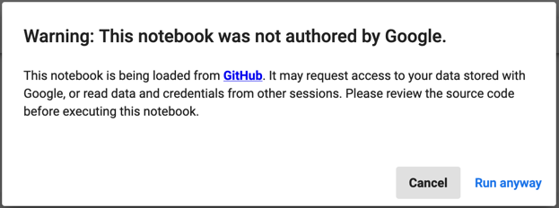
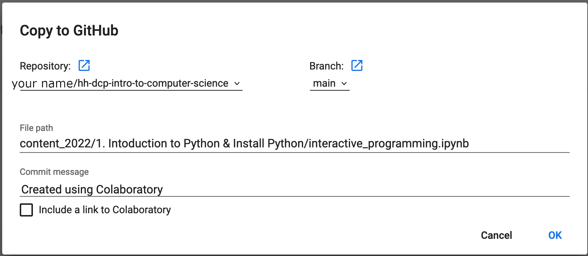

# 19 Oct - Introduction to Python / Google Colab

## About

Colab, or "Colaboratory", allows you to write and execute Python in your browser, with

    Zero configuration required
    Access to GPUs free of charge
    Easy sharing

## Pre Requisites

You need a GitHub account and have your credentials ready.

## Class Curriculum

| Section content                             | Expected time (mins) | Pre - Requirements |
|---------------------------------------------|----------------------|--------------------|
| Lesson Goals                                | 2 minutes            | ❌                  |
| preparing Project for editing and importing | 5 minutes            | GitHub account     |
| Introduction to Colab                       | 15 minutes           | GitHub account     |

## Lesson Goals

- Have a working development environment on Python without any installation.
- open a Project using GitHub
- Storing changes to your copy

## preparing Project for editing and importing

open [hh-dcp-intro-to-computer-science](https://github.com/ReDI-School/hh-dcp-intro-to-computer-science)
and sign into your GitHub account.

On the GitHub page for this project, klick on the -button to prepare your own copy 
to store your changes afterwards. You can keep all the presets and press "Create fork".

Now you 'own' a copy of 'hh-dcp-intro-to-computer-science' in your GitHub.
Henceforth, you will use your copy's URL to checkout the code.

## Introduction to Colab

Jupyter Notebooks are documents, which contain both python code and rich text elements (paragraph, equations, figures, links, etc…).
Notebook documents are both human-readable documents containing the analysis description and the results (figures, tables, etc..)
as well as executable documents which can be run to perform data analysis.

Colab (short for Colaboratory) provides a Python editor in the Google cloud whose interface is 
displayed in a browser similar to a Jupyter notebook. 
The Python interpreter runs on a powerful computer with a GPU in the Google cloud.

### open notebook files
[https://colab.research.google.com/?hl=en](https://colab.research.google.com/?hl=en)

There you can open the menu "file/open notebook". In the pop-up window select the "GitHub" tab. 
You need to grant "Google Colaboratory" in the following dialogs by entering your GitHub credentials.

Select the 'hh-dcp-intro-to-computer-science' repository in the drop down menu and klick on the 
"interactive_programming.ipynb" jupyter notebook. Jupyter notebooks have the file extension '.ipynb'

You can edit the Page content and execute the code blocks. Colab may issue a security warning, which you may accept at your own peril.

### save notebook files
If you want to save your work for later (highly recommended), select the "File/Save a copy in GitHub" menu item.
You can keep most presets, but please enter something meaningful as a "Commit message", as this will help you later to 
understand the goal of the change. Press "OK"  

This will create a new version of the file in your copy of the GitHub project. 