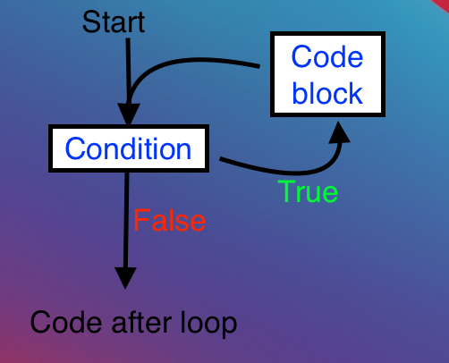

# 07 Nov - Control Flow (while and for loops)


## Pre Requisites

- Review the course content from last class, and try to continue going through the exercises! If you get stuck on any of them, no problem -- make a note of this so we can review these tasks at the beginning of class on Thursday.

  

- (Optional) create a repository (local and remote) to gather your Python exercises from last class. Add and commit the file to the repository, and then push these to GitHub.
- (Optional practice) go through exercises on [w3 schools for Python](https://www.w3schools.com/python/exercise.asp?filename=exercise_syntax1) through `Functions` section OR on particular areas that you would like to review. This is entirely optional but good practice! No need to go over `Lambda`, `Classes`, `Inheritance`, or `Modules` as we have not seen these yet.

---

## Class Curriculum

| Section content                                                     | Expected time (mins) | Pre - Requirements |
| ------------------------------------------------------------------- | -------------------- | ------------------ |
| Lesson Goals                                                        | 5 minutes            | ❌                 |
| Questions from last class & review of a few exercises               | 10-15 minutes        | ❌                 |
| Overview of loops (for, while)                                      | 10-15 minutes        | ❌                 |
| Hands-on Python exercises (in small groups)                         | 20 minutes           | ❌                 |
| Break (in-person troubleshooting of Python installations if needed) | 10 minutes           | ❌                 |
| Continue hands-on Python exercises (in small groups)                | rest of class        | ❌                 |
| Check-out                                                           | 5 minutes            | ❌                 |

## 0. Lesson Goals

- Have a working development environment on Python.
- Build familiarity with the concepts of data types, functions, and control flow (loops, conditionals)
- Continue writing code in Python

## 1. Check-In

- Are there any remaining questions from last class?
- What exercises were the most challenging? (Respond in the chat)

## 2. for and while loops

Loops are a tool that help us execute a block of code a specified amount of times or based on a condition. In Python, there are two loops: `for` and `while` loops.

### while loops

`while` loops allow us to execute a block of code as long as the condition evaluates to `True`.



_Please excuse the ugly diagram :)_

Syntax:

```python
while condition:
    # do things
```

Examples:

```python
# This is called an "infinite loop" since the condition is always True!!
while True:
    print("I'm an infinite loop! I won't stop unless I'm forced to!")
```

```python
count = 0
while count < 10:
    print("hello #", count)
    # increment the value of `count`
    count += 1
    # outputs:
    # hello # 0
    # hello # 1
    # hello # 2
    # hello # 3
    # hello # 4
    # hello # 5
    # hello # 6
    # hello # 7
    # hello # 8
    # hello # 9

```

```python
text = ''
while text != 'stop':
    text = input('Tell me something:\n')
    print('you told me:', text)
print('... and I\'m stopping')
```

```python
num = int(input('Give me a number:\n'))
counter = 0
while num > 0:
    num //= 2
    counter += 1
print('Your number contains', counter, 'twos')
```

```python
```

Check-in question: can someone explain what's going on in each of these examples?

### for loops

`for` loops provide a way to go through each value (or set of values) in an iterable (e.g. a list, string, dictionary, etc.) and execute a block of code that uses that value.

Syntax:

```python
for variable(s) in iterable:
    # do things
```

Examples: (feel free to try executing these in your IDLE terminal, notebook cell (in Colab), VSCode, or PyCharm :)

```python
for num in [1, 2, 3]:
    print(num)
    # outputs:
    # 1
    # 2
    # 3
```


```python
#for loop over a list
l = [12, 3, -11, 12.5, 146, 33.82]
for num in l:
    num += 50
print(l)
```

```python
#for loop over a string
for letter in 'word':
    new_word = letter + '!!'
    print(new_word)
    # outputs:
    # w!!
    # o!!
    # r!!
    # d!!
```

```python
# python
for num, letter in [(1, 'a'), (2, 'b')]:
    # Here, we convert number to string using `str` before concatenating with another string
    print(str(num) + letter)
    # outputs:
    # 1a
    # 2b

```

With `for` loops, it can also be useful to use the `range` operator in Python which creates an iterable of numbers. The syntax of this is `range(start, end, step)`, but you will also see this as just `range(start, end)` or `range(end)` (in this last case, the `start` is assumed to be 0). Note that the `end` value is not included (in other words, "numbers starting with `start` up until (not through) `end`"). Here are some examples:

```python
for i in range(3):
    print(i)
    # outputs:
    # 0
    # 1
    # 2
```

```python
list(range(1, 4))  # we can create a list out of a `range`
# [1, 2, 3]
```

```python
list(range(-1, 9, 3))  # here, the step (space between values) is 3
# [-1, 2, 5, 8]
```

→ with the help of the `for` loop we can for example iterate over a list.
```python
for item in list:
  # do something
```
### Task

```python
s = 'this is a random string with several letters \'a\''
counter = 0
for character in s:
    if character == 'a':
        counter += 1
print('Found', counter, 'letters \'a\' in the given string')
```

## Additional Resources

- [W3 schools Python while loops](https://www.w3schools.com/python/python_while_loops.asp)
- [W3 schools Python for loops](https://www.w3schools.com/python/python_for_loops.asp)
- [Tutorialspoint loops in Python](https://www.tutorialspoint.com/python3/python_loops.htm)
- [additional practice problems on loops and conditions (note: some are challenging!)](https://www.w3resource.com/python-exercises/python-conditional-statements-and-loop-exercises.php)
- [additional practice problems (note: challenging!)](https://www.practicepython.org/)
